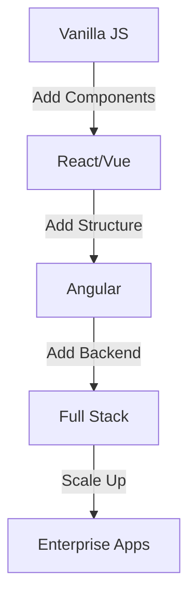

# From Vanilla JS to Full-Stack: A Developer's Journey Through Real Projects

*A candid look at evolving from frontend basics to complex full-stack applications*


## TL;DR (The Elevator Pitch)
- 🎯 Started with vanilla JS countdown timer
- 🚀 Progressed to React, Vue, and Angular apps
- 🔧 Mastered backend with Node.js and Django
- 📈 Built 8 production applications
- 💡 Key lessons from each stage

## The Beginning: Vanilla JavaScript

Every developer's journey has a starting point. Mine was the [Event Countdown Timer](https://event-countdowns.netlify.app) - a seemingly simple project that taught fundamental lessons.

```javascript
// My first production code (Event Countdown Timer)
class CountdownTimer {
  constructor(deadline, element) {
    this.deadline = new Date(deadline);
    this.element = element;
    this.interval = null;
  }

  start() {
    this.interval = setInterval(() => {
      const remaining = this.getTimeRemaining();
      this.updateDisplay(remaining);
      
      if (remaining.total <= 0) {
        clearInterval(this.interval);
      }
    }, 1000);
  }

  getTimeRemaining() {
    const total = this.deadline - new Date();
    const seconds = Math.floor((total / 1000) % 60);
    const minutes = Math.floor((total / 1000 / 60) % 60);
    const hours = Math.floor((total / (1000 * 60 * 60)) % 24);
    const days = Math.floor(total / (1000 * 60 * 60 * 24));
    
    return { total, days, hours, minutes, seconds };
  }
}
```

### Key Lessons from Vanilla JS:
1. DOM manipulation
2. Event handling
3. Time operations
4. Class-based programming
5. Browser APIs

## Level Up: Enter React

After mastering the basics, I moved to React with the [Habit Tracker](https://habitss-tracker.netlify.app).

```jsx
// First React component (Habit Tracker)
const HabitTracker = () => {
  const [habits, setHabits] = useState([]);
  
  const addHabit = useCallback((habit) => {
    setHabits(prev => [...prev, {
      id: Date.now(),
      name: habit,
      streaks: 0,
      lastChecked: null
    }]);
  }, []);

  return (
    <div className="habit-container">
      <HabitForm onAdd={addHabit} />
      <HabitList habits={habits} />
    </div>
  );
};
```

### The React Revelation:
- Component-based thinking
- State management
- Virtual DOM
- Hooks and lifecycle
- Reusable components

## Exploring Vue: The Finance Tracker

Next came Vue.js with the [Personal Finance Tracker](https://tracks-finances.netlify.app).

```vue
<!-- Finance Tracker Component -->
<template>
  <div class="finance-dashboard">
    <expense-chart :data="chartData" />
    <transaction-list
      :transactions="transactions"
      @delete="deleteTransaction"
    />
    <add-transaction @add="addTransaction" />
  </div>
</template>

<script setup>
import { ref, computed } from 'vue'

const transactions = ref([])
const chartData = computed(() => 
  processTransactionsForChart(transactions.value)
)

const addTransaction = (transaction) => {
  transactions.value.push({
    ...transaction,
    id: Date.now()
  })
}
</script>
```

### Vue's Unique Offerings:
- Template syntax
- Reactive system
- Single-file components
- Built-in state management
- Great documentation

## Angular Territory: Fitness Scheduler

The journey continued with Angular in the [Fitness Class Scheduler](https://fitnessss-tracker.netlify.app).

```typescript
// Fitness Scheduler Component
@Component({
  selector: 'app-schedule',
  template: `
    <div class="schedule-container">
      <schedule-calendar
        [classes]="classes$ | async"
        (classSelected)="onClassSelect($event)"
      />
      <class-details
        *ngIf="selectedClass"
        [class]="selectedClass"
        (book)="bookClass($event)"
      />
    </div>
  `
})
export class ScheduleComponent {
  classes$ = this.classService.getClasses();
  selectedClass: FitnessClass | null = null;

  constructor(private classService: ClassService) {}

  bookClass(classId: string) {
    this.classService.bookClass(classId).subscribe(
      response => this.showBookingConfirmation()
    );
  }
}
```

### Angular's Enterprise Lessons:
- TypeScript integration
- Dependency injection
- RxJS and observables
- Module system
- Testing framework

## The Full-Stack Leap: MERN Stack

The [Attendance System](https://attendance-syst.netlify.app) marked my entry into full-stack development.

```javascript
// Backend API with Express
const express = require('express');
const router = express.Router();

router.post('/attendance', async (req, res) => {
  try {
    const { studentId, date, status } = req.body;
    
    const attendance = new Attendance({
      student: studentId,
      date,
      status,
      recordedBy: req.user._id
    });

    await attendance.save();
    
    // Trigger real-time updates
    io.emit('attendance-update', {
      studentId,
      status
    });

    res.json({ success: true, attendance });
  } catch (error) {
    res.status(500).json({ error: error.message });
  }
});
```

### Full-Stack Revelations:
- API design
- Database management
- Authentication
- Real-time updates
- Deployment strategies

## The Django Python Adventure

The [E-Learning Platform](https://elearn-platform.netlify.app) combined Django with React.

```python
# Django Views
from rest_framework import viewsets
from rest_framework.permissions import IsAuthenticated

class CourseViewSet(viewsets.ModelViewSet):
    queryset = Course.objects.all()
    serializer_class = CourseSerializer
    permission_classes = [IsAuthenticated]

    def get_queryset(self):
        user = self.request.user
        if user.is_instructor:
            return Course.objects.filter(instructor=user)
        return Course.objects.filter(enrolled_students=user)

    def perform_create(self, serializer):
        serializer.save(instructor=self.request.user)
```

### Python Backend Lessons:
- ORM usage
- REST framework
- Authentication
- File handling
- Database optimization

## The Evolution Timeline

| Stage | Project | Key Technologies | Main Lessons |
|-------|---------|-----------------|--------------|
| 1 | Countdown Timer | Vanilla JS | Fundamentals |
| 2 | Habit Tracker | React | Component Design |
| 3 | Finance Tracker | Vue | State Management |
| 4 | Fitness Scheduler | Angular | Enterprise Patterns |
| 5 | Attendance System | MERN Stack | Full-Stack Dev |
| 6 | E-Learning Platform | Django + React | Scalability |

## Critical Turning Points

1. **The Framework Decision**
```javascript
// From this (Vanilla JS):
document.querySelector('.timer').innerHTML = formatTime(remaining);

// To this (React):
return <Timer remaining={remaining} />;
```

2. **State Management Evolution**
```javascript
// From local state:
let count = 0;

// To Redux:
const counterSlice = createSlice({
  name: 'counter',
  initialState: { value: 0 },
  reducers: {
    increment: state => { state.value += 1 }
  }
});
```

3. **Backend Integration**
```javascript
// From localStorage:
localStorage.setItem('habits', JSON.stringify(habits));

// To API calls:
await api.post('/habits', newHabit);
```

## Key Lessons for Aspiring Developers

1. **Start Simple**
   - Master the basics
   - Build small projects
   - Understand core concepts

2. **Progressive Learning**
   - Add complexity gradually
   - Learn from real problems
   - Keep building

3. **Technology Choices**
   - Pick tools based on needs
   - Don't chase trends blindly
   - Focus on fundamentals

## Project Progression Strategy



## Common Pitfalls to Avoid

1. **Skipping Fundamentals**
```javascript
// DON'T start here:
const app = new Vue({...})

// DO master this first:
document.getElementById('app')
```

2. **Framework Dependence**
```javascript
// DON'T rely only on framework features
const [state, setState] = useState()

// DO understand the underlying concepts
let state = {
  data: null,
  subscribers: []
}
```

## Resources That Helped

1. Documentation
2. Open Source Projects
3. Real-world Problems
4. Community Support
5. Practice Projects

## What's Next?

Current learning targets:
- Microservices Architecture
- Cloud Native Development
- AI/ML Integration
- WebAssembly
- Edge Computing

## See the Journey in Action

Check out the progression through my projects:
1. [Event Countdown Timer](https://event-countdowns.netlify.app)
2. [Habit Tracker](https://habitss-tracker.netlify.app)
3. [Personal Finance Tracker](https://tracks-finances.netlify.app)
4. [Fitness Scheduler](https://fitnessss-tracker.netlify.app)
5. [Attendance System](https://attendance-syst.netlify.app)
6. [E-Learning Platform](https://elearn-platform.netlify.app)

## Share Your Journey

What's your development path looking like? Share your experiences in the comments below!

---

*About the Author: Ancel Ajanga is a full-stack developer who loves sharing knowledge and helping others grow. Follow my development journey on my [portfolio](/).*

*Tags: #WebDevelopment #JavaScript #FullStack #Programming #Learning #Development #React #Vue #Angular #2025*